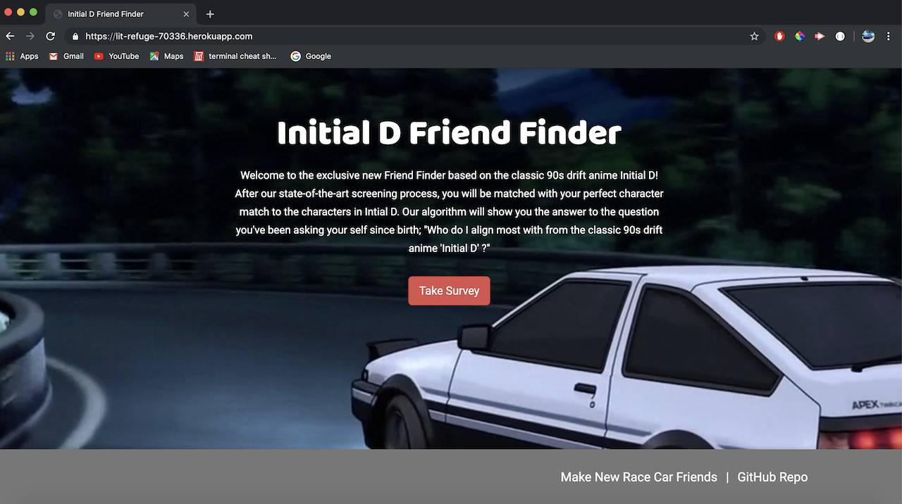

# Initial-D friend-finder

## Description

*Friend Finder* implements friend matching based on the user's responses to a ten question survey. The user responds to questions with values from 1 (Strongly Disagree) to 5 (Strongly Agree). When the survey is submitted, the restults are then compared to the characters scores from the show, whome ever you matched the closest with is then displayed on the screen.

*Initial-D Friend Finder* application is meant to show you who you bes associate with from the popular 90s drift anime 'Initail-D'. The application is implemented using a [Node.js](https://nodejs.org/en/) and [Express](https://expressjs.com/) server on the back end and the [Bootstrap](https://getbootstrap.com/) CSS framework on the front end.

## Demo
	
*Friend Finder* is deployed to Heroku. Please check it out [here](https://lit-refuge-70336.herokuapp.com/).

## Installation

To install the application follow the instructions below:

	git clone git@github.com:angrbrd/friend-finder.git
	cd friend-finder
	npm i body-parser express path
	
## Running Locally

To run the application locally and access it in your browser, first set the `PORT` environment variable to the value of your choice. An example is shown below.

	export PORT=8080
	
After the `PORT` environment variable has been set, run the Node.js application with the command below.

	node server.js
	
The application will now be running locally on `PORT`, in this case that is port 8080. You can then access it locally from your browser at the URL `localhost:PORT`, in this case `localhost:8080`.

